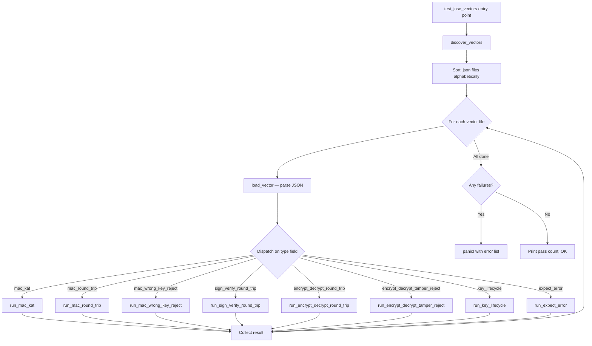
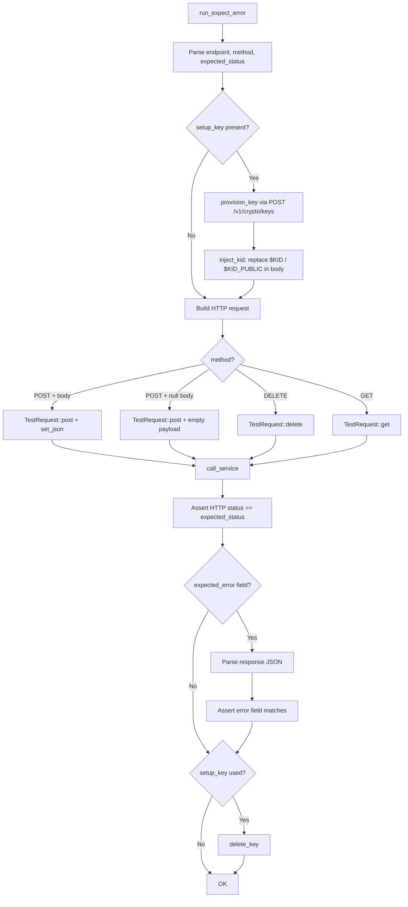
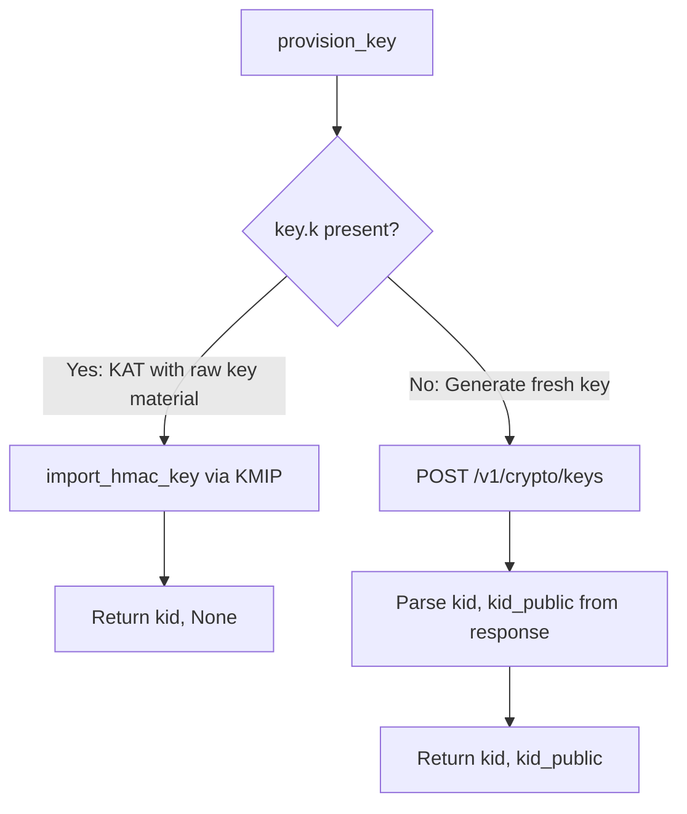
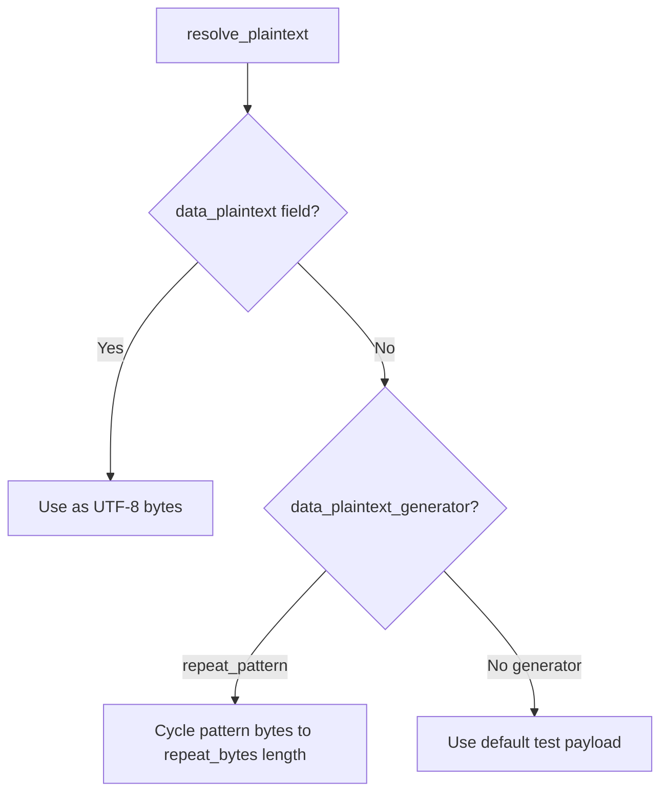
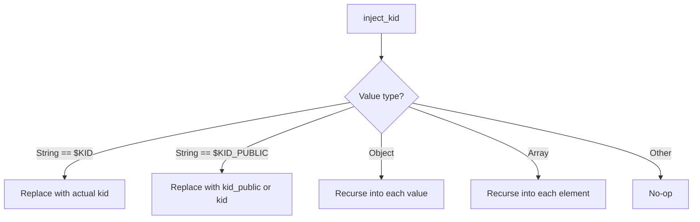

# JOSE Test Vectors

This directory contains JSON test vector files for the JOSE (JSON Object Signing and Encryption) REST crypto endpoints (`/v1/crypto/{encrypt,decrypt,sign,verify,mac,keys}`).

## Sources

- **RFC 7515** — JSON Web Signature (JWS): Appendix A examples (HS256 KAT, RS256, ES256, ES512)
- **RFC 7516** — JSON Web Encryption (JWE): Security edge cases (AAD binding, tampered tag/ciphertext, empty plaintext)
- **RFC 7518** — JSON Web Algorithms (JWA): Section 3/5 algorithms (RS384, RS512, PS256, PS384, PS512, ES384, HS384, HS512, A128GCM, A192GCM, A256GCM)
- **RFC 7520** — Examples of Protecting Content Using JOSE (Cookbook): Sections 4.1–4.4
- **RFC 8725** — JSON Web Token Best Current Practices: `alg:none` rejection (§2.1)

## Vector Types

| `type` field                     | Description                                           |
| -------------------------------- | ----------------------------------------------------- |
| `mac_kat`                        | Known-answer test: import key, compute MAC, assert exact output |
| `mac_round_trip`                 | Generate key, compute MAC, verify MAC                 |
| `mac_wrong_key_reject`           | Compute MAC with key A, verify with key B → must fail |
| `sign_verify_round_trip`         | Generate key pair, sign, verify                       |
| `encrypt_decrypt_round_trip`     | Generate key, encrypt, decrypt, assert plaintext match |
| `encrypt_decrypt_tamper_reject`  | Encrypt, tamper with a field, decrypt must fail       |
| `unwrap_key_round_trip`          | RSA-OAEP encrypt → unwrap CEK → encrypt/decrypt with CEK |
| `key_lifecycle`                  | Create key → use (mac/sign/encrypt) → delete → verify gone |
| `expect_error`                   | Send malformed/invalid request, assert HTTP error status and code |

## Algorithms Covered

### Signing (JWS)
- RS256, RS384, RS512 (RSASSA-PKCS1-v1_5)
- PS256, PS384, PS512 (RSASSA-PSS)
- ES256 (P-256), ES384 (P-384), ES512 (P-521)

### MAC (JWS)
- HS256, HS384, HS512 (HMAC-SHA2)

### Encryption (JWE)
- `dir` + A128GCM, A192GCM, A256GCM (direct key agreement with AES-GCM)
- RSA-OAEP, RSA-OAEP-256 key wrapping + A128GCM, A192GCM, A256GCM (via key unwrap endpoint)

## Error / Edge Case Coverage

### Negative Tests (`expect_error` vectors)

| Category | Vectors | Covers |
| -------- | ------- | ------ |
| Encrypt errors | `error_encrypt_*.json` | empty body, missing data, invalid base64, unsupported alg, unknown enc, nonexistent kid, wrong key type |
| Decrypt errors | `error_decrypt_*.json` | empty body, invalid protected b64, protected not JSON, missing kid in header, wrong IV length, wrong tag length, encrypted_key with dir |
| Sign errors | `error_sign_*.json` | empty body, HMAC on sign endpoint, nonexistent kid, invalid base64, algorithm-key mismatch |
| Verify errors | `error_verify_*.json` | empty body, `alg:none` attack (RFC 8725), forged signature, empty signature |
| MAC errors | `error_mac_*.json` | empty body, nonexistent kid, invalid base64, invalid mac base64, wrong key type |
| Keys errors | `error_keys_*.json` | empty body, unknown kty, oct without alg, EC without crv, unknown curve, RSA bits too small, delete nonexistent |
| Unwrap errors | `error_unwrap_*.json` | unsupported alg (dir), missing enc, empty encrypted_key, invalid protected base64 |

### Edge Case / Stress Tests (`edge_*` vectors)

| Vector | Tests |
| ------ | ----- |
| `edge_encrypt_1mb_payload` | 1 MB plaintext encrypt/decrypt round-trip (memory pressure) |
| `edge_encrypt_single_byte` | Minimal 1-byte plaintext (boundary condition) |
| `edge_encrypt_binary_data` | Null bytes and control characters in plaintext |
| `edge_encrypt_very_long_kid` | 4096-char kid field (buffer overflow resistance) |
| `edge_encrypt_extra_fields` | Extra unexpected JSON fields (must be ignored gracefully) |
| `edge_encrypt_wrong_key_type` | RSA key for direct AES-GCM encryption |
| `edge_sign_unicode_payload` | Emoji + CJK + accented chars in payload |
| `edge_sign_large_payload` | 64 KB signing payload (timeout/memory) |
| `edge_sign_sql_injection_kid` | SQL injection in kid field |
| `edge_mac_null_bytes` | All-zero payload for MAC |
| `edge_mac_json_injection_kid` | JSON/NoSQL injection in kid field |
| `edge_mac_path_traversal_kid` | Path traversal attempt in kid field |
| `edge_mac_null_bytes_in_kid` | Null bytes embedded in kid string |

## Not Covered (unsupported by server)

- RSA1_5 key management (RFC 7516 A.2)
- AES Key Wrap: A128KW, A192KW, A256KW (RFC 7518 §4.4)
- AES-CBC-HMAC: A128CBC-HS256, A192CBC-HS384, A256CBC-HS512 (RFC 7518 §5.2)
- ECDH-ES key agreement (RFC 7518 §4.6)

---

## Test Runner

The test runner is located at:
`crate/server/src/tests/rest_crypto/jose_vectors.rs`

It loads these JSON files at test time, provisions keys, calls the appropriate REST endpoints, and asserts expected behavior.

### Architecture Overview



### Detailed Flow: `run_expect_error`



### Key Provisioning Flow



### Plaintext Resolution



### `inject_kid` Placeholder Replacement



### `expect_error` Vector Format

```json
{
  "type": "expect_error",
  "endpoint": "/v1/crypto/encrypt",
  "method": "POST",
  "body": { "kid": "$KID", "alg": "dir", "enc": "A128GCM", "data": "dGVzdA" },
  "setup_key": { "kty": "oct", "alg": "A256GCM" },
  "expected_status": 422,
  "expected_error": "crypto_failure"
}
```

| Field | Required | Description |
| ----- | -------- | ----------- |
| `type` | yes | Must be `"expect_error"` |
| `endpoint` | yes | REST path (e.g. `/v1/crypto/encrypt`) |
| `method` | no | HTTP method, default `"POST"` |
| `body` | yes | JSON body to send (use `null` for no body) |
| `setup_key` | no | If present, generates a key and injects `$KID`/`$KID_PUBLIC` into body |
| `expected_status` | yes | Expected HTTP status code (e.g. 400, 404, 422) |
| `expected_error` | no | If present, asserts the `error` field in the JSON response |

### Error Codes Returned by the Server

| Code | HTTP Status | Meaning |
| ---- | ----------- | ------- |
| `bad_request` | 400 | Malformed request (missing fields, invalid base64, parse error) |
| `not_found` | 404 | Key ID does not exist |
| `forbidden` | 403 | Access denied |
| `unsupported_algorithm` | 422 | Algorithm not supported or `alg:none` |
| `crypto_failure` | 422 | Cryptographic operation failed (wrong key type, size mismatch) |
| `internal_error` | 500 | Unexpected server error |
